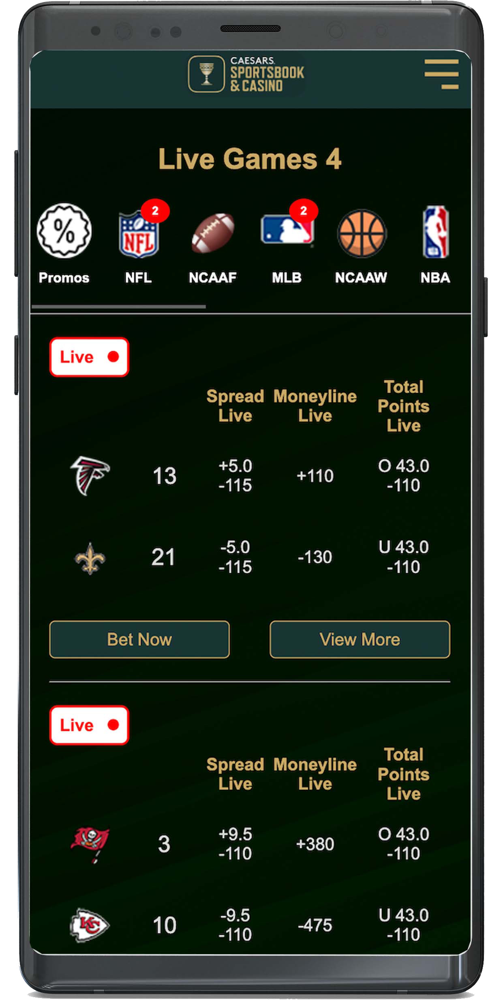
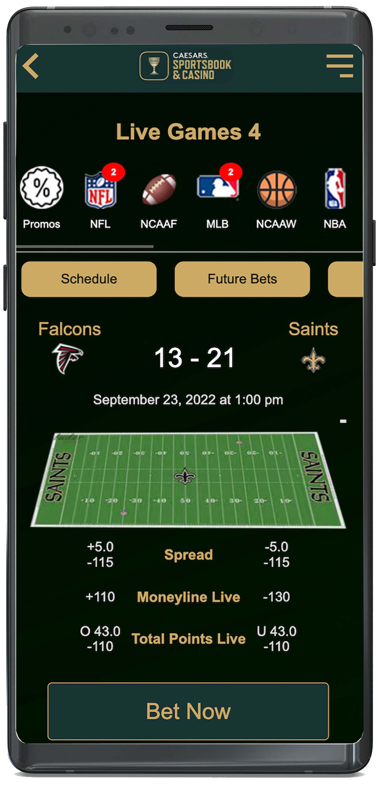
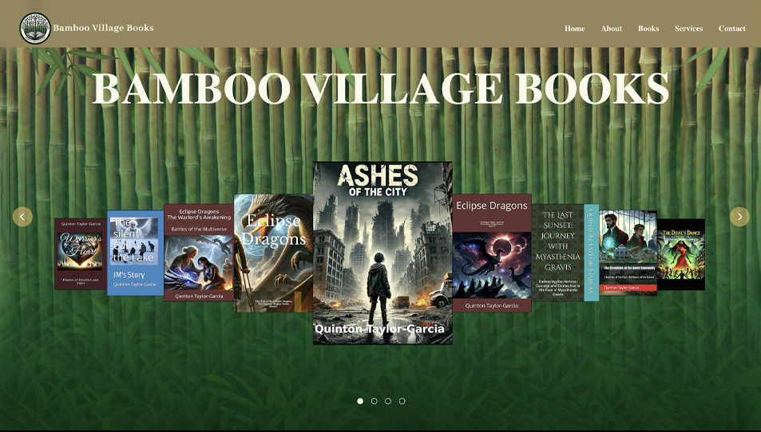

# Sports Betting App 
Mobile mock-up version of the Caesars Sportsbook app designed to be easily navigable to users.
<!--  -->

**Link to project:** https://codefitness21.github.io/Sports-Betting-App/

## How It's Made
Tasked by Digital Seat Media to create a simplistic sports betting app that could be used for casino apps. Caesars Sportsbook and Casino requested a mock design of their sports betting app. Initially, I lacked the experience and knowledge base in sports betting. Once I understood the direction of my research, I began designing low and high-fidelity wireframe mockups in an XD document, outlining and prototyping how I wanted the app to look and operate. Once finalized and approved, I began coding the app using HTML, CSS, and JavaScript, designed for mobile view. CSS flexbox was used to structure most of it to regulate the spacing and dimensions, thus allowing proper alignment for images and text.

## Lessons Learned:
This was my first big coding project with Digital Seat Media. Having learned JavaScript, I can make the calculator more functional, and with knowledge of Vue, build it in a framework where it's more structured using components for streamlining the development process, routing, and clean code. 

## Examples:

### Here are some other examples of my work:                                                                                                                                              
   

 

      
<strong>Portfolio</strong>

      
    

    

      
<strong>Bamboo Village Books </strong>

      
    

    

      
<strong>Extrahands</strong>

      
    

